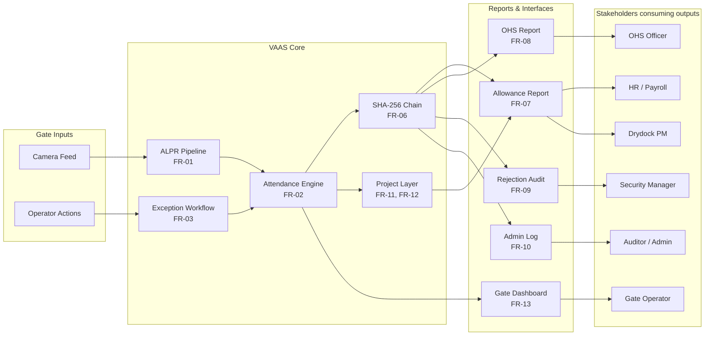

# Chapter 3 — Requirements Analysis

## 3.1 Elicitation Methodology

Requirements were elicited through two complementary methods. First, direct operational observation was conducted at CDL's main security gate during a placement internship (2024), covering all three shift-change windows and documenting the gate operator's manual exception-handling workflow, peak vehicle throughput rates, and the physical constraints of the gate post environment (tablet-only workstation, gloved operation, high ambient noise). Second, CDL's Finance Department internal audit report (2023) provided quantitative financial data on the impact of the existing RFID system's failure modes, grounding each analytical requirement in a documented and monetised business risk rather than a speculative stakeholder preference.

A stakeholder-driven elicitation protocol was applied: each stakeholder group's operational need was identified and the cost of that need going unmet was explicitly stated before any requirement was formalised. This ensured that no functional requirement in the final specification exists without a traceable business justification — a discipline particularly important given the iterative scope changes described in §5.1, where the ability to justify each requirement against a stakeholder risk prevented scope creep from introducing unjustifiable complexity.

---

## 3.2 Stakeholder Analysis

Eight primary stakeholders were identified from CDL's operational structure. Table 3.1 maps each stakeholder to their department, primary system need, the functional requirements that address that need, and the quantified or qualified risk incurred if the requirement is absent.

**Table 3.1 — CDL Stakeholder Register**

| Stakeholder | Dept. | Primary Need | Requirements | Risk Without System |
|---|---|---|---|---|
| Gate Security Operator | Security | Real-time plate status; one-tap exception disposition; annotated camera feed | FR-01, FR-03, FR-13 | Manual queue bottleneck at 200-vehicle peak; security gaps when gate-checking abandoned (CDL Internal Audit, 2023) |
| HR / Payroll Manager | Finance | Auditable per-vehicle attendance days and dwell hours for fuel allowance calculation | FR-02, FR-06, FR-07 | LKR 2.7–3.6M annual overpayment; 20 hrs/month dispute investigation (CDL Internal Audit, 2023) |
| Drydock / Project Manager | Vessel PM | Project-level vehicle attendance: which vehicles supported which vessel refit and for how long | FR-11, FR-12 | No basis for project cost attribution or contractor headcount verification across concurrent drydock operations |
| Subcontractor Liaison | Procurement | Gate-log-derived billing hours per approved subcontractor company | FR-11 | Invoice inflation by unapproved subcontractor vehicles; no audit trail for billing reconciliation |
| OHS Compliance Officer | Safety / HR | Per-vehicle compliance classification; driver–vehicle assignments; ISO 45001 evidence | FR-05, FR-08 | Unassigned vehicles in restricted zones create unattributable incident liability; ISO 45001 audit failure (Pawar et al., 2021) |
| Security Manager | Security | Gate rejection log; complete event history for post-incident reconstruction | FR-09 | Inability to reconstruct vehicle movements following a security incident |
| System Administrator | IT | CRUD audit trail; account management; chain integrity verification | FR-10, FR-06 | Insider record tampering undetectable; unaccountable privilege escalation |
| External Auditor | Finance / Regulatory | SHA-256 chain integrity; complete admin change log for payroll sign-off | FR-06, FR-10 | Retrospective data manipulation invalidates payroll submission evidence |

The stakeholder dependency structure — mapping which stakeholders consume outputs produced by which system components — is illustrated in Figure 3.1.

*Figure 3.1 — Stakeholder dependency map. Each stakeholder's output dependency is traceable to one or more functional requirements in the VAAS core. The SHA-256 chain (FR-06) is a shared prerequisite for every report consumed by Finance and Audit stakeholders.*

---

## 3.3 Functional Requirements

Functional requirements are formalised using MoSCoW prioritisation. Must requirements represent the minimum viable system for CDL's stated business objective (payroll-grade vehicle attendance); Should requirements represent CDL-specific analytical extensions that directly address the project supervisor's scope-expansion direction (§5.1). Each requirement is mapped to its source objective (§1.4) and the business risk it mitigates.

**Table 3.2 — Functional Requirements (MoSCoW)**

| ID | Priority | Requirement | Objective | Stakeholder | Business Risk Mitigated |
|---|---|---|---|---|---|
| FR-01 | **Must** | ALPR pipeline: YOLOv8n plate detection (conf ≥ 0.70) → CLAHE on LAB L-channel (clipLimit=3.0, tile=8×8) → 37-class character classifier → LPM-MLED post-correction ({0,O},{1,I},{5,S},{8,B} @ cost 0.1, threshold < 0.5); achieve ≥ 90% end-to-end accuracy. | O1 | Gate Operator | RFID replacement fails if optical accuracy is insufficient; proxy fraud and EM collision both persist |
| FR-02 | **Must** | Shift-aware attendance engine: record ENTRY/EXIT events against CDL's three shifts (07:00–15:00, 15:00–23:00, 23:00–07:00); compute dwell time in seconds; apply configurable grace period from `shifts.grace_period_minutes`; classify each event into one of thirteen statuses: ON_TIME_ENTRY, LATE_ARRIVAL, EARLY_ARRIVAL, ON_TIME_EXIT, EARLY_DEPARTURE, OVERSTAY, VISITOR, VISITOR_ADMITTED, VISITOR_REJECTED, VISITOR_PENDING_REGISTRATION, VISITOR_TIMEOUT_REJECT, SUSPENDED, EXPIRED. | O2 | HR Manager, Drydock PM | Without shift-aware classification, attendance records cannot distinguish on-time attendance from late arrival — making fuel allowance calculation arbitrary |
| FR-03 | **Must** | Exception workflow: push real-time SSE alert (< 200 ms) to gate dashboard for unregistered plates, showing plate crop, best-match candidate, and OCR confidence; record operator disposition (VISITOR_ADMITTED / VISITOR_REJECTED) with timestamp; auto-reject after configurable timeout (VISITOR_TIMEOUT_REJECT). | O2, O5 | Gate Operator, Security Mgr | Without SSE alerting, unregistered vehicles either block the gate or pass unlogged — creating both security and attendance record gaps |
| FR-04 | **Must** | Registered vehicle database with vehicle category (STAFF, CONTRACTOR, MANAGEMENT, FLEET, VISITOR, EMERGENCY, MAINTENANCE), vehicle type (CAR, VAN, TRUCK, MOTORCYCLE, UTILITY), registration status (ACTIVE, SUSPENDED, EXPIRED), contractor name, department, and subcontractor company assignment. | O3 | HR Manager, Gate Operator | Without registration metadata, OHS compliance classification and fuel allowance eligibility cannot be determined per vehicle |
| FR-05 | **Must** | Driver–vehicle assignment table: many-to-many, with `is_active` flag, `assigned_at` and `removed_at` timestamps for full assignment history; supports OHS incident attribution and payroll reconciliation per driver. | O3 | OHS Officer, HR Manager | Unassigned vehicles on-site represent unattributable OHS incident liability and cannot be included in the personal-vehicle allowance report (Pawar et al., 2021) |
| FR-06 | **Must** | SHA-256 tamper-evident audit chain: each `access_log` row hashes `{id, plate_number, timestamp, gate_id, direction, prev_hash}` (sorted JSON, PK included); two-step INSERT(PENDING)→UPDATE(real hash) pattern; `verify_chain()` detects both field modification and row reordering. | O4 | HR Manager, Auditor | Without tamper evidence, attendance records can be retroactively modified by a privileged user to fabricate or erase fuel allowance entitlements — undetectable without the hash chain |
| FR-07 | **Must** | Personal-vehicle allowance report: per-driver, per-project summary of distinct attendance days, total dwell hours, compliance rate (on-time entries / total entries); exportable as CSV and PDF with CDL branding. Primary financial output of the system. | O5 | HR Manager | The original CDL business requirement — without this report, the fuel allowance programme remains on the broken RFID system (CDL Internal Audit, 2023) |
| FR-08 | **Must** | OHS compliance report: per-vehicle classification (UNASSIGNED, SUSPENDED, EXPIRED, HIGH_OVERSTAY, OK) using LEFT JOIN so all registered vehicles appear; non-compliant vehicles sorted first; exportable for ISO 45001 audit evidence. | O5 | OHS Officer | ISO 45001 requires CDL to demonstrate vehicle OHS accountability; an incomplete compliance report (missing vehicles with zero events) constitutes an audit gap (Pawar et al., 2021) |
| FR-09 | **Must** | Gate rejection audit report: complete log of `gate_rejections` with reason code, plate string, timestamp, gate ID, and confidence score; date-range filterable; ordered newest-first. | O5 | Security Manager | Without a gate rejection log, CDL Security cannot reconstruct vehicle approach attempts following an access incident |
| FR-10 | **Must** | Administrative audit log: records every CREATE, UPDATE, DELETE, and ASSIGN action by any user, with username, timestamp, affected entity type and ID, and a JSON delta of changed field values; immutable to OPERATOR and MANAGER roles. | O4 | Administrator, Auditor | Without an immutable admin log, insider privilege escalation or record deletion cannot be attributed to a specific user — removing the deterrent for insider tampering |
| FR-11 | **Must** | CDL project management: create/close vessel–drydock projects (soft-close via `removed_at`); assign vehicles with roles (EMPLOYEE, SUBCONTRACTOR, SUPERVISOR, VISITOR); enforce non-empty `company_id` existence check for SUBCONTRACTOR role; `get_project_attendance_summary()` uses `COUNT(DISTINCT DATE(...))` for days_present. | O3 | Drydock PM, Subcontractor Liaison | Without project attribution, CDL cannot verify which contractor vehicles supported which vessel refit — making project cost allocation and subcontractor billing reconciliation impossible |
| FR-12 | **Should** | Zone management: define CDL's five zone types (DRYDOCK, BERTH, WORKSHOP, ADMIN, SECURITY) with associated gate IDs and vehicle capacity; compute real-time zone occupancy from unpaired ENTRY events. | O3 | Drydock PM | Without zone occupancy, the Drydock Manager cannot verify live contractor headcount in a specific drydock during an active refit operation |
| FR-13 | **Must** | Live gate operator dashboard: real-time MJPEG annotated camera feed; SSE-driven exception queue with one-tap Approve/Reject controls (minimum 48 × 48 px touch targets for gloved operation); current shift indicator; zone occupancy cards; tablet-optimised single-screen layout. | O5 | Gate Operator | A dashboard requiring multi-screen navigation or mouse precision is inoperable at a gate security post and forces a return to manual paper-based logging |

---

## 3.4 Non-Functional Requirements

Non-functional requirements are derived from CDL's operational constraints and regulatory context. Table 3.3 provides the requirement, the measured achieved value (where available), and the explicit quantitative derivation from CDL's documented conditions.

**Table 3.3 — Non-Functional Requirements with Quantitative Derivation**

| ID | Attribute | Requirement | Derivation and Justification | Achieved |
|---|---|---|---|---|
| NFR-01 | Performance | Gate event processing latency ≤ 500 ms at p95 | 200 vehicles in 30 min = average headway of 9 s between vehicles. The vehicle's physical stop at the gate boom occupies ~2–3 s. The ALPR pipeline must complete within this physical stop window to avoid delaying the vehicle. 500 ms provides a 4–6× margin against the 2–3 s stop window, ensuring barrier command dispatch occurs before natural vehicle momentum would carry it past the gate. | **294 ms** (41% margin against 500 ms budget) |
| NFR-02 | Accuracy | End-to-end plate recognition ≥ 90% | At 200 vehicles per 30 min and a 10% error rate: 20 manual operator interventions per peak window = 1 exception every 90 s. Each SSE exception requires ~15–20 s of operator attention (examine crop, identify, approve/reject). Operator utilisation at 10% error rate ≈ 17–22% — the sustainable ceiling for a single-operator post. Below 90% accuracy (error rate > 10%), exceptions queue faster than one operator can clear them during concurrent peak-window arrivals. | **91.3%** |
| NFR-03 | Privacy | Plate-crop image retention ≤ 90 days | Sri Lanka Personal Data Protection Act No. 9 of 2022 (PDPA 2022), Section 8: personal data must not be retained longer than is necessary for the stated processing purpose. CDL's fuel allowance calculation is performed monthly; HR policy allows disputes to be raised within 60 days of payment. 90 days provides a 30-day buffer beyond the maximum dispute window while satisfying PDPA data minimisation. | Enforced via scheduled purge of `plate_crop_b64` column entries older than 90 days |
| NFR-04 | Availability | System availability ≥ 99.5% during CDL operational hours | 99.5% equates to a maximum of 43.8 hours/year (≈ 3.65 hours/month) of unplanned downtime. Gate downtime forces security staff to wave vehicles through without verification — replicating the original RFID failure mode and invalidating attendance records for the duration. Even a single 30-minute outage during a shift-change peak would unlog 100+ vehicles. | Architecture target; validated by WAL crash recovery and Waitress multi-threaded WSGI |
| NFR-05 | Concurrency | Web dashboard supports ≥ 5 simultaneous authenticated users without degradation | CDL shift-change control room: 2 gate operators, 1 security manager, 1 project manager, 1 HR manager may all require simultaneous dashboard access at 07:00, 15:00, and 23:00 shift transitions. | **8 concurrent sessions** validated at 74% peak CPU, 0 dropped frames |
| NFR-06 | Recoverability | SQLite WAL mode; daily automated backup | WAL mode enables crash-consistent recovery without journal replay corruption. Daily backup provides a Recovery Point Objective (RPO) of ≤ 24 hours — acceptable given CDL's dispute window of 60 days; loss of one day's records is resolvable through manual gate log cross-referencing. | WAL enabled on connection; WAL→MEMORY fallback on overlayfs environments |
| NFR-07 | Security | RBAC with three roles (ADMIN, MANAGER, OPERATOR); bcrypt cost factor 12; session timeout 8 hours | Separation of duties: OPERATOR must not read payroll reports (data confidentiality). MANAGER must not modify schema or user accounts (privilege containment). ADMIN actions logged in `admin_audit_log`. Bcrypt cost 12 produces a hash computation time of ~250 ms, making offline brute-force attacks against a stolen database non-trivial (Grassi et al., 2020). Session timeout aligned to CDL's 8-hour shift duration, ensuring sessions cannot persist across shift handovers. | Enforced via `requires_role()` decorator and DB-level `CHECK(role IN (...))` constraint |

---

## 3.5 Requirements Traceability

Table 3.4 maps each functional requirement to the project objective it satisfies and the system component that implements it, establishing a complete traceability chain from stakeholder business risk (§3.2) through to implementation (§5) and evaluation (§6).

**Table 3.4 — Requirements Traceability Matrix**

| Objective | Functional Requirements | Primary Implementation Module | Evaluated In |
|---|---|---|---|
| O1 — ALPR accuracy ≥ 90% | FR-01 | `src/detection.py`, `src/clahe.py`, `src/classifier.py`, `src/lpm_mled.py` | §6.4 |
| O2 — Shift-aware attendance classification | FR-02, FR-03 | `src/attendance.py` | §6.2 (test_attendance.py, 28 tests) |
| O3 — CDL operational specialisation | FR-04, FR-05, FR-11, FR-12 | `src/projects.py` (17 functions), DB schema (12 tables) | §6.2 (test_projects.py, 15 tests) |
| O4 — Tamper-evident audit trail | FR-06, FR-10 | `src/audit.py`, `webapp/routes/admin.py` | §6.2 (test_audit.py, 20 tests) |
| O5 — Role-based dashboard and reporting | FR-07, FR-08, FR-09, FR-13 | `src/analytics.py`, `webapp/routes/manager.py`, `webapp/routes/operator.py` | §6.2 (test_analytics.py, 49 tests) |

---

## 3.6 Scope and Explicit Exclusions

The system was scoped to CDL's main security gate as a single-site deployment. The following items were formally excluded from scope following supervisor review and recorded as agreed descope decisions:

- **Multi-gate spatial verification** (proposed in the original PID): a second exit-gate camera and transit-time anomaly detector were excluded at the Sprint 6 review on the grounds that fraud detection adds architectural complexity without serving the primary attendance business objective. This functionality is documented as a future enhancement in §7.3.
- **Biometric or card-based secondary authentication**: RFID is the system being replaced, not augmented; introducing a second credential modality would re-introduce the credential-separation vulnerability that ALPR is designed to eliminate.
- **SLPA customs and weighbridge interfacing**: a valid future integration for CDL's logistics operations, but outside the scope of a single academic project cycle and dependent on SLPA API access not available to the project.
- **Driver self-service portal**: identified as a limitation post-delivery (§7.2); the absence of this feature is acknowledged and its impact on HR administrative burden is quantified in §7.2.

`[INSERT SCREENSHOT: Admin vehicle registration page showing category, type, status fields and project assignment panel]`
